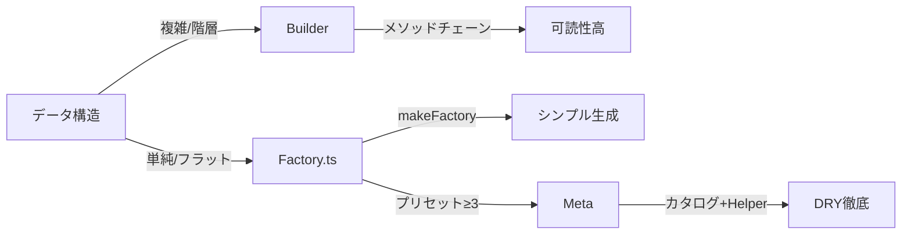

# ファクトリー規約

```yaml
記号: ✅=必須 | ❌=禁止 | ⚠️=注意
適用: /sc:test 実行時
目的: データ生成一元化
上位: CLAUDE.md, test/CLAUDE.md
```

---

## 役割

```yaml
Single Source of Truth: 全テストデータ生成元
AI機械解釈: 自動理解可能構造
絶対規則: 規約外実装禁止
```

---

## パターン選択



### ✅ Builder（第一推奨）

```yaml
適用: 複雑ネスト | 複数状態 | 頻繁差分
利点: 意図明示 | 保守容易 | 型安全
```

```typescript
// メソッドチェーンで意図明示
MessageBatchResponseBuilder.success()
  .withBreakdownData({ supplierName: '業者A', amount: 1000000 })
  .build();
```

### Factory.ts（限定許容）

```yaml
適用: 単純構造 | 状態1-2種 | 上書き稀
```

```typescript
const userFactory = Factory.Sync.makeFactory<User>({
  id: Factory.each(i => i),
  name: Factory.each(i => `user-${i}`),
});
```

### ✅ Meta（プリセット≥3で必須）

```yaml
適用: プリセット3個以上
利点: DRY徹底 | SSOT | スケーラブル | 保守O(1)
原則: データ駆動型 | 重複コード0%
構造: カタログ定義→Helper→1行メソッド
```

```typescript
// 1. プリセット定義カタログ（Single Source of Truth）
const USER_PRESETS = {
  admin: { role: 'admin', permissions: ['all'] },
  guest: { role: 'guest', permissions: [] },
  moderator: { role: 'moderator', permissions: ['read', 'write'] },
} as const;

// 2. Helper（共通ロジック集約）
const createPreset =
  (def: (typeof USER_PRESETS)[keyof typeof USER_PRESETS]) =>
  (overrides?: Partial<User>) =>
    userFactory.build({ ...def, ...overrides });

// 3. 1行メソッド（重複排除）
export const UserFactory = {
  resetSequenceNumber: () => userFactory.resetSequenceNumber(),
  build: (overrides?: Partial<User>) => userFactory.build(overrides),

  /** 管理者プリセット */
  admin: createPreset(USER_PRESETS.admin),
  /** ゲストプリセット */
  guest: createPreset(USER_PRESETS.guest),
  /** モデレータープリセット */
  moderator: createPreset(USER_PRESETS.moderator),
} as const;
```

**判断フロー**:

```yaml
プリセット数判定:
  0-2個: Factory.ts標準（現状維持）
  3個以上: ✅Meta必須（重複排除）
  理由: 保守コスト O(n)→O(1)、重複コード0%実現
```

---

## 必須実装

### `resetSequenceNumber()`

```yaml
目的: テスト独立性保証
実装: 全ファクトリー必須
使用: beforeEach フックで呼出（test/CLAUDE.md）
```

```typescript
export const UserFactory = {
  resetSequenceNumber: () => userFactory.resetSequenceNumber(),
  // ...
};
```

### JSDoc

```yaml
対象: ファクトリー | 全公開メソッド | プリセット
目的: AI機械理解
```

```typescript
/**
 * バッチキュー生成
 * @example const queue = BatchQueueFactory.createProcessingBatch();
 */
export const BatchQueueFactory = {
  /** PROCESSING状態バッチ生成 */
  createProcessingBatch: (overrides?: Partial<BatchQueue>) => {
    /* ... */
  },
};
```

### 型安全性

```yaml
必須: as const | ジェネリクス活用
❌禁止: any
```

---

## Builder設計

### プリセットメソッド

```yaml
目的: 頻繁状態を一行生成
⚠️YAGNI: 未使用プリセット作成禁止
```

```typescript
class UserBuilder {
  static admin() {
    return new UserBuilder({ role: 'admin', permissions: ['all'] });
  }
}
```

### 部分上書き（`.withXxx()`）

```typescript
class OrderBuilder {
  withCustomer(customer: Customer): this {
    this.data.customer = customer;
    return this;
  }
}
```

---

## 高度パターン

### 階層データ

```typescript
export const OrderFactory = {
  buildWithItems: () => ({
    customer: CustomerFactory.build(),
    items: [OrderItemFactory.build(), OrderItemFactory.build()],
  }),
};
```

### 関連データ

```typescript
export const TestScenarioFactory = {
  userWithOrders: () => {
    const user = UserFactory.build();
    const orders = [OrderFactory.build({ userId: user.id })];
    return { user, orders };
  },
};
```

---

## アンチパターン

```yaml
❌禁止:
  プリセット≥3で従来型: 重複コード発生→保守コスト高
  カタログ未使用: データ分散→整合性リスク
  createPreset未使用: 共通ロジック重複→DRY違反

✅対策:
  プリセット増加時: 即Meta移行（operation-catalog.factory.ts参照）
  定義の一元化: XXX_PRESETS as const
  型安全性保持: typeof PRESETS[keyof typeof PRESETS]
```

---

## テスト利用

### ✅ ファクトリーファースト（絶対）

```yaml
必須: ファクトリーから生成
❌禁止: オブジェクトリテラル手動作成
理由: 生成元一元管理→仕様変更耐性
詳細: test/CLAUDE.md §2
```

```typescript
// ✅ OK
const user = UserFactory.build({ role: 'admin' });

// ❌ NG
const user = { id: 1, name: 'test', role: 'admin' };
```

### ✅ ハイブリッド推奨

```yaml
方法: ベースはファクトリー→重要差分のみ上書き
目的: テスト意図明確化+可読性
```

```typescript
it('管理者は全リソースアクセス可', () => {
  // role='admin' が重要と明示
  const admin = UserFactory.build({
    role: 'admin',
    permissions: ['all'],
  });
  expect(admin.canAccess('admin-panel')).toBe(true);
});

// Builder版
it('エラー時もbreakdown保持', () => {
  const error = Builder.error()
    .withBreakdownData({ supplierName: '業者A' })
    .build();
  expect(error.isSuccess).toBe(false);
  expect(error.breakdown).toBeDefined();
});
```
